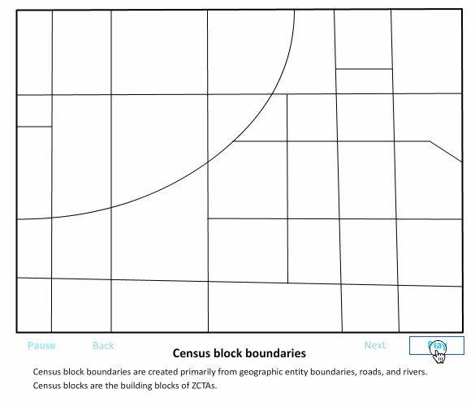

WTF, Zipcodes?
--------------

_[Mr. ZIP](https://en.wikipedia.org/wiki/Mr._ZIP)_

[ZIP codes](https://en.wikipedia.org/wiki/ZIP_code) are the
United States Postal Service's method for identifying a mail delivery route. Practically, they are often used as a method to denote a general locality on web applications that rely on user location (i.e. nearby restaurants).

ZIP codes are often a source of confusion because they're fundamentally different from other types of location data.

## ZIP Codes are sets of points, not areas

[Area of the state of Arkansas (Licensed CC BY-SA 3.0)](https://commons.wikimedia.org/wiki/File:Arkansas_in_United_States.svg#/media/File:Arkansas_in_United_States.svg)

Regions like states, countries, and counties are defined by their borders and when represented as geographic data they are represented as polygons. This means that these regions have area, centerpoints, and a simple way to determine whether a given point is inside or outside of the region.

> USPS ZIP Codes are not areal features but a collection of mail delivery routes. -[USPS](https://www.census.gov/programs-surveys/geography/guidance/geo-areas/zctas.html)

ZIP Codes are not regions or polygons: they are collections of points. The original purpose of the ZIP Code is to organize mail delivery points into convenient groups for mail carriers, so points are chosen based off of roads and accessibility, not regions.

The final 2 digits of a zip code have very little geographical meaning, but the first 3 do. That said, these aren't guarantees around this meaning: while the first digit tends to identify that a ZIP Code is within a given group of states, it doesn't guarantee that the code stays within a single state.

* 0: state group (this includes many New England states)
* 79: region (this area of New Jersey)
* 30: delivery group

## [ZCTAs](https://www.census.gov/programs-surveys/geography/guidance/geo-areas/zctas.html) are approximations of ZIP Codes as areas

Enough people expect ZIP codes to be areas and want to do calculations based on them as areas that the US Census Bureau has created generalized polygon representations called ZCTAs (ZIP Code Tablulation Areas). These are generated by assigning each census block to a ZCTA based upon the most frequent ZIP Code within that block:

_How ZCTAs are born (courtesy [U.S. Census Bureau](https://www.census.gov/programs-surveys/geography/guidance/geo-areas/zctas.html))_

There are gotchas in this process, since there are many places in the United States with no addresses, so they don't clearly belong to any ZIP. There are also ZIP codes that are completely unique - buildings and military bases can have their own ZIP even if they're totally surrounded by buildings with a different ZIP.

## Geographical Q&A

> What ZIP code is this longitude, latitude point within?

**Not clearly defined**: ZIP Codes contain address points, and are not areas. You can answer this question with either

* Determining which ZCTA the geographical point fits inside
* Snapping the point to an address and the address will have a ZIP code

> Given this ZIP Code, what state, congressional district, etc is this person in?

**Not clearly defined**: ZIP Codes have rough, estimated centerpoints, but are not really a good way to indicate areas. [1](zip)

> What ZIP code is this address in?

This **is clearly defined**: every address has a ZIP code, and you can find this with most geocoders.

## Notes

* ZIP & ZCTA are both acronyms, and thus should be upper-case: Zone Improvement Plan, and ZIP Code Tabulation Areas
* ZIP Code is a trademark of the USPS.  ZCTA is a trademark of the US Census Bureau.

[zip]: https://sunlightfoundation.com/blog/2012/01/19/dont-use-zipcodes/
